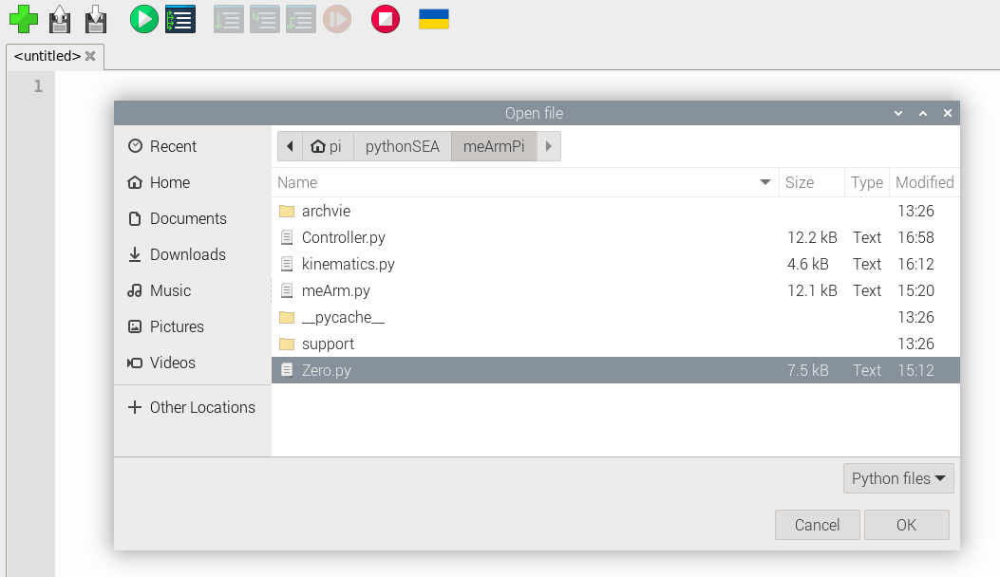
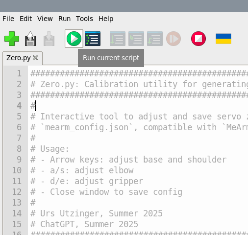

# SEA2025

In our BME sophomore design course we build robots and create games.
This years game was [Popper](https://sites.google.com/email.arizona.edu/bme210/design-competition/competition-2025) ) and we want you to play it too.

[Urs Utzinger](https://bme.engineering.arizona.edu/faculty-staff/faculty/urs-utzinger)

## Requirements

### Infrastructure

- Each team needs at least one `monitor`, `keyboard` and `mouse`.
- Each meArm needs `two power outlets`
- To play the game you need a `desk` where you can setup your meArms
- Each meArm needs either a keyboard or gamepad (preferred)
- If you use a gamepad, it needs to be connected through USB cable (bluetooth is not supported)

### Parts

  

| Product      | Number   | Description | Location  |
|--------------|----------|-------------|-----------|
| **Joystick**   | 1      | Lightweight, 13" display   | Bring your own |
| **Raspberry Pi**   | 2  | Lightweight, 13" display   | Bring your own |
| **Motor Hat** | 3       | 6.1" OLED, 128 GB storage      | $699   |
| **Power RasPi** | 4     | Noise-cancelling over-ear       | $199   |
| **Power Motors**  | 5   | | | |
| **Flash Drive**  | 6   | | | |
| **HDMI Monitor Interface**  | 7   | | | |
| **meArm**  | 8   | | | |
| **Balloons** |
| **Needles** |
| Tape |
| Hot Glue | 
| Rubber Bands |

## Connecting the Hardware

The motor cables need to be attached to the motor hat. The order and orientation matters.

  

- Black or brown is GND [G]
- Orange or white is Signal [S]

There are three motors
- Base connects to slot 0
- Shoulder connects to slot 1
- Elbow connects to slot 14
- Gripper connects to slot 15

You will need to provide power to the Motor Hat. Please make sure the color of the cables matches this picture

  

- Red is 5-12V
- Black is Ground/GND

## Powerin up the Raspberry Pi

Before you power up the Raspberry Pi you need to
- insert the flash drive into one of the two blue USB connectors
- `DO NOT REMOVE THE DRIVE WHILE THE Raspberry Pi IS POWERD ON`
- You can connect the monitor to the HDMI connector cable [7]
- You can attach mouse and keyboard USB cable

## Starting the Software

The Raspberry Pi will boot into the desktop. To start your meArm you will need run the calibration program `Zero.py` and then you can run the control programm `Controller.py`

Start Thonny

  

### Calibrate

Load and run `Zero.py`

  

  

  

With all motors running you will want to align them so that 

- The meArm points straight forward (base) 
- The shoulder of the meArm (fist segment) points straight up
- The elbow of the meArm (second segment) is horizontal
- The gripper is closed (do not force it beyond the two finger touching each other)

The instructions tell you which keys on the keyboard will move which motors.
Once you are satisfied with the alignment you close the window with the `X` and the calibration is saved.

If you click on window other than meArm Calibration, the program will no longer read the input.

## Attaching Needle and Balloons

The balloons can be inflated with compressed air hose or with your lung.

You can use tape or elastic bands to attach them

The needles can be attached or fixed with hot glue.

## Playing the Game

Load the controller program.

  

Now you can play with the meArm. 

  

You can use the keyboard or the gamepad. 
Once the program is running you can disconnect the monitor.
If you have a gamepad you can also disconnect the keyboard.

**The gamepad needs to be attached prior to starting the software.**

## Scoring

For the game to be fair, the needle as well as a part of the balloon needs to touch a finger piece of the gripper.

- A good game lasts about 1 minute
- Poppin a ballon is one point
- Keeping your own ballon not being popped is one point
- Popping all balloons of the opposing team before the one minute mark gives one point for every 10 seocnds rmaining time.
- If there is a tie you play until one ballon is popped.
- When your balloon is popped, the referee should diable your needle with a piece of tape.

